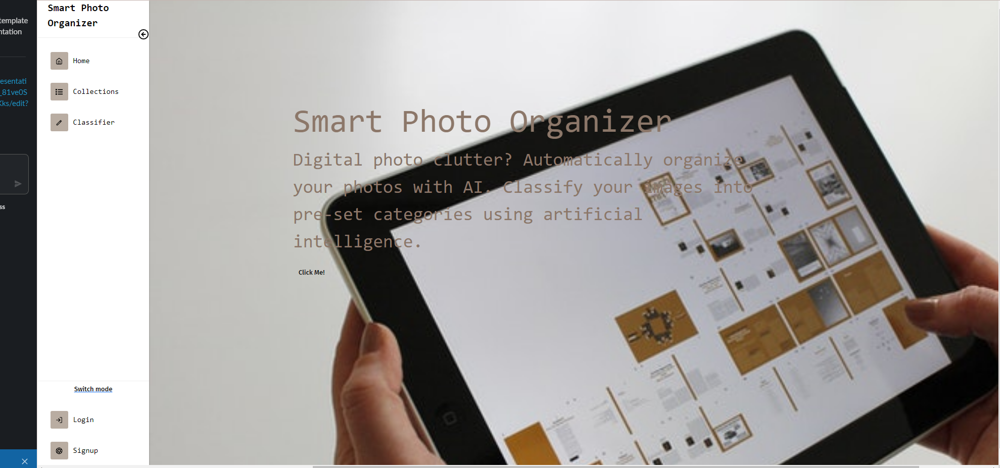
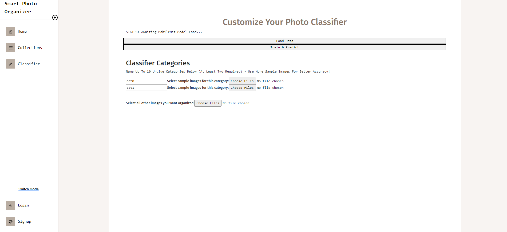
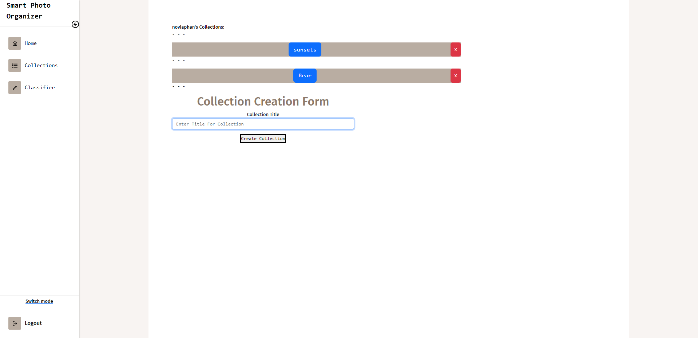

# Project 3: Smart Photo Organizer with AI

## Description

 Digital Clutter is the disorganization of your data, files in your your digital devices. Organize your photos using artificial intelligence. AI will be able to categorize, organize your stored photos. The user will be able to train the AI in the browser to learn features from the photos and categorize them

 ## User Story 
As a User with many photos, I would like to automatically organize my photos into pre-set categories using artificial intelligence, so that I don’t have to tediously organize all similar present and future photos manually. 

 ## Table of Contents

- [Installation](#installation)
- [Usage](#usage)
- [Credits](#credits)
- [License](#license)

## 💡 Installation 

[Heroku deployed Link](https://projectthree3.herokuapp.com/)

 `npm install`
 

## Usage 

`npm run develop`

## 🏆 Credits

- [Colin Brooks](https://github.com/Danqest)
- [Alfredo Figueroa](https://github.com/supanov)
- [Novia Phan](https://github.com/AJFigueroa83)

---
© 2022 Trilogy Education Services, LLC, a 2U, Inc. brand. Confidential and Proprietary. All Rights Reserved.
